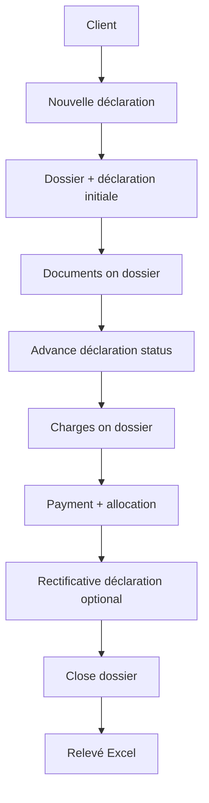

# User flows

See **[00-glossary.md](./00-glossary.md)**. Flows use **déclaration** language; system creates **dossier** when needed.

---

## Flow 0 — First login

```
Login → /dashboard (empty state)
  → Optional: theme toggle (top-right) before sign-in
  → Onboarding card: "Ajoutez un client" / "Créez votre première déclaration"
  → Tabs: Tableau de bord (●), Déclarations, Dossiers, Clients, Transactions, Réglages
  → Profile menu: Apparence (Clair / Sombre / Système), Se déconnecter
```

---

## Flow 1 — Create client

Same as before → `/clients/[id]`.  
Notion: **Customers** table.

---

## Flow 2 — Create déclaration (core daily action)

**Actor:** Operator  
**Entry:** **+ Nouvelle déclaration**, `/declarations/new`, ⌘K

```
1. Select client
2. "Nouveau dossier" (default) or attach to existing open dossier
3. Type dossier: Import | Export | Transit
4. Type déclaration: Initiale (or Rectificative if existing dossier)
5. Optional BL, titre
6. Créer
7. → /declarations/[id]  status = Brouillon
8. System: dossier + declaration + numbers assigned
9. Activity: declaration.created, dossier.created (if new)
```

**Notion parallel:** new row in **Declarations** with relation to client.  
**Improvement:** dossier created automatically; numbers assigned; FSM enforced.

**Typical session on fiche:**

```
10. Upload BL on dossier (link to dossier documents)
11. Fill n° douane, bureau on déclaration
12. Advance statut → Documents en attente → Déposée → …
```

---

## Flow 2b — Add rectificative déclaration

**Actor:** Operator  
**Entry:** Dossier fiche or déclaration fiche → **Ajouter une déclaration**

```
1. Dossier 2025-018 pre-selected
2. kind = rectification
3. Créer → new DEC-0043 linked to same dossier
4. Independent status pipeline (starts Brouillon)
5. List /declarations shows two rows, same dossier column
```

**Notion pain:** duplicate unrelated rows.  
**Improvement:** explicit link + kind.

---

## Flow 3 — Advance déclaration status

**Entry:** Fiche déclaration → stepper / statut / ⋯

```
1. Open "Changer le statut"
2. Allowed next states only (customs FSM)
3. Note optional
4. Confirm → declaration_status_history + activity
```

**Not:** changing status on dossier (case only has open/closed).

---

## Flow 4 — Upload document

**Entry:** `/dossiers/[id]` → Documents (job-level)

```
1. + Document, type, file
2. Optional: link to déclaration (DAU, quittance)
3. Activity on dossier
```

---

## Flow 5 — Record charge

**Entry:** Dossier → Finances → + Frais / honoraires

```
1. Amount, category, label, date
2. Optional: attribuer à déclaration DEC-0042
3. dossier_id required
4. Updates dossier financial summary + client solde
```

---

## Flow 6 — Payment & allocation

Unchanged logic; allocations target **dossier_id** (job).  
Entry: Client → Transactions.

---

## Flow 7 — Reverse entry

Unchanged.

---

## Flow 8 — Relevé Excel

Client fiche → **Relevé Excel** → `GET /api/clients/[id]/releve` → `.xlsx` (journal du compte, soldes, dates fr-FR / Africa/Dakar).

---

## Flow 9 — Morning triage

```
Login → /dashboard
→ Section "À faire" lists cross-entity priorities
  (stale declarations, missing n° douane, overdue soldes, dossiers ready to close)
→ click row → fiche concerned
→ back to dashboard or move to Déclarations tab for full DB view
```

**Improvement over Notion/filters:** triage is cross-entity (déclarations + clients + dossiers) and pre-filtered.

---

## Flow 10 — Close job

**Actor:** Admin / accountant

```
Dossier fiche → Clôturer le dossier
→ case_status = closed
→ warn if déclarations still active or balance due
```

---

## Happy path (demo)



---

## MVP UX build order (updated)

1. Shell + auth  
2. **Declarations** table + fiche + status FSM  
3. Auto-create dossier on new déclaration  
4. Dossier hub (tabs: déclarations, documents, finances)  
5. Clients + transactions  
6. Rectificative flow  
7. Search, PDF, dashboard  

---

## French copy

| Event | Toast |
|-------|-------|
| Created | « Déclaration DEC-0044 créée » |
| Status | « Statut mis à jour : En vérification » |
| Rectificative | « Déclaration rectificative ajoutée au dossier 2025-018 » |
